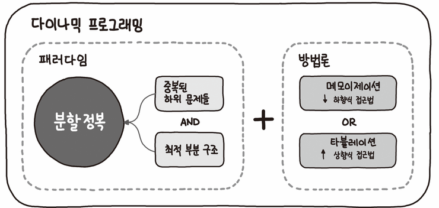
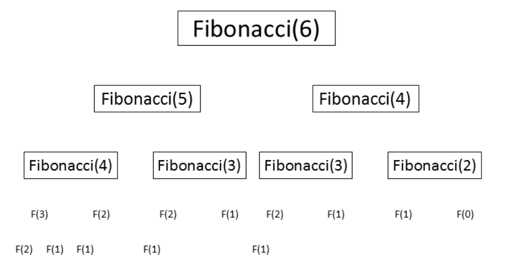

[toc]

# Dynamic Programming

> **동적 프로그래밍**(동적계획법) 은 [수학적 최적화](https://en.wikipedia.org/wiki/Mathematical_optimization) 방법이자 컴퓨터 프로그래밍 방법입니다. 이 방법은 1950 년대 [Richard Bellman](https://en.wikipedia.org/wiki/Richard_Bellman) 에 의해 개발되었으며 [항공 우주 공학](https://en.wikipedia.org/wiki/Aerospace_engineering) 에서 [경제학에](https://en.wikipedia.org/wiki/Economics) 이르기까지 다양한 분야에서 응용되고 있습니다 . [위키피디아](https://en.wikipedia.org/wiki/Dynamic_programming)

> '작은 문제의 답을 조합해서 큰 문제의 답을 푼다'

> 동적계획 알고리즘은 그리디 알고리즘과 같이 최적화 문제를 해결하는 알고리즘

- 답을 재활용해서 다시 사용해 비효율적인 계산을 줄인다.(==한 번의 계산을 통해 답을 구한다.)(현재의 답을 구하기 위해 전에 구해놨던 답을 이용한다)
- 제일 대표적인 예시 : 피보나치!
  - 잘 알려진 피보나치 풀이법은 재귀함수지만 재귀함수를 사용하면 숫자가 커질 수록 계산해야하는 횟수도 많아진다. -> 오버플로우 발생
  - 동적 계획법을 사용하면 이전의 계산 결과를 다시 이용하면서 계산하는 횟수가 줄어들게 되고 보다 효율적으로 계산을 할 수 있다. 





### 다이나믹 프로그래밍 알고리즘 적용 조건

1. Overlapping Subproblem 

   중복되는 부분 문제.(피보나치)

2. Optimal Substructrue 

   문제의 정답을 작은 문제의 정답으로 구할 수 있다. 

   정답을 구한 뒤 Memoization(메모)해놓고 이 답을 이용하여 큰 문제를 푼다. 

#### i. 또보나치

```python
def fibo(n):
    if n <2:
        return n
    else:
        return fibo(n-1) + fibo(n-2)
```

> 익숙한 피보나치 구하는 방법. 엄청난 중복 호출 존재





#### ii. Memoization을 이용한 피보나치

```python
# fibo(n)의 값을 계산하자마자 저장(memoization)하면 실행시간을 O(n)으로 줄일 수 있다.
# memo를 위한 배열 할당, 모두 0으로 초기화
# memo[0]을 0으로 memo[1]는 1로 초기화 한다

def fibo1(n):
    global memo
    # 배열 memo의 리스트 크기가 n과 같아질때까지
    if n >= 2 and len(memo) <= n:
        # n-1과 n-2의 값을 합친 것이 memo의 새로운 숫자로 들어간다.
        memo.append(fibo1(n-1) + fibo1(n-2))
    return memo[n]
memo = [0,1]
```

#### iii. DP를 이용한 피보나치

```python
def fibo2(n):
    f = [0,1]
    
    for i in range(2, n+1):
        f.append(f[i-1] + f[i-2])
        
    return f[n]
```

### TOP DOWN(Memoization)

1. 문제를 부분문제로 분할
2. 부분 문제로 나누는 일을 끝냈응면 가장 작은 부분 문제부터 해를 구한다.
3. 그 결과는 테이블에 저장하고, 테이블에 저장된 부분 문제의 해를 이용하여 상위 문제의 해를 구한다.

### BOTTOM UP(Dynamic Programming)

1. 가장 작은 문제부터 푼다.
2. 문제의 크기를 점점 크게 만들어서 전체문제를 푼다.

**메모이제이션과 다이나믹 프로그래밍의 특징**은 다음과 같다.

1) 메모이제이션이나 다이나믹 프로그래밍 둘다 순환식을 계산하는 방법이라고 할 수 있다.

2) 모두 동적 계획법의 일종이라고 보기도 한다.

3) 메모이제이션은 Top down 방식이고 실제 필요한 sub problem을 푼다, 

4) 다이나믹 프로그래밍은 Bottom up 방식이며 재귀에 수반되는 overhead가 없다.


### + 동적계획법을 이용하는 알고리즘 문제

https://www.acmicpc.net/problem/2839

https://www.acmicpc.net/problem/1463

https://www.acmicpc.net/problem/11726

https://www.acmicpc.net/problem/12865
